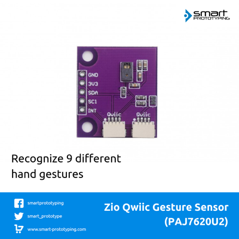

# Zio-Qwiic-Gesture-Sensor-PAJ7620U2

> This product can be available for purchase [here](https://www.smart-prototyping.com/Zio-Qwiic-Gesture-Sensor-PAJ7620U2).

#### Description

This is a Qwiic breakout board based on PAJ7620U2. It can recognize 9 human hand gesticulations such as moving up, down, left, right, forward, backward, circle-clockwise, circle-counter clockwise, and waving. 

The normal gesture detecting range is 5 to 15 cm, and the operating view angle is at 60° diagonally. The PAC7620 also offer built-in proximity detection for the purpose of sensing an object approaching or departing.

As it is a [Qwiic compatible](https://www.smart-prototyping.com/Qwiic.html) module, you can use [Qwiic cable](https://www.smart-prototyping.com/zio-cables) to daisy chain it with other Qwiic devices, no need soldering and jumper wire connecting!

#### Specification

* Operation Voltage: 3.3V
* Current: 2.3mA
* Gesture speed: 60~600°/s in normal mode
* Interface: I2C
* IC: PAJ7620U2
* I2C address: 0x73
* Dimension: 26.3 x 23.3mm
* Weight: 1.6g

#### Links
* [PCB Source file](https://github.com/ZIOCC/Zio-Qwiic-Gesture-Sensor-PAJ7620U2/tree/master/EAGLE)
* [PCB schematic](https://github.com/ZIOCC/Zio-Qwiic-Gesture-Sensor-PAJ7620U2/blob/master/zio%20qwiic%20gestuer%20sensor%20PAJ7620U2%20schematic.pdf)
* [Demo code](https://github.com/Seeed-Studio/Gesture_PAJ7620)
* [Sensor PAC7620 Datasheet](https://github.com/ZIOCC/Zio-Qwiic-Gesture-Sensor-PAJ7620U2/blob/master/PAJ7620U2_datasheet.pdf)

###### About Zio
> Zio is a new line of open sourced, compact, and grid layout boards, fully integrated for Arduino and Qwiic ecosystem. Designed ideally for wearables, robotics, small-space limitations or other on the go projects. Check out other awesome Zio products [here](https://www.smart-prototyping.com/Zio).
